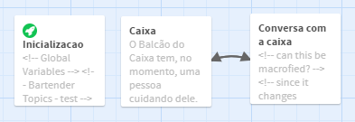

# O diálogo

Um exemplo está em [ConversacomTópicos.html](ConversacomTópicos.html)

Este exemplo foi baseado em: [http://twine.analytical-engine.co.uk/Cookbook.html](http://twine.analytical-engine.co.uk/Cookbook.html)

Uma alternativa a esse exemplo, aparentemente anterior, aparece em: [http://twinery.org/questions/10457/using-datamaps-conversation-javascript-display-passages](http://twinery.org/questions/10457/using-datamaps-conversation-javascript-display-passages)




## Estrutura básica

1. Temos uma função que deve ser declarada no início do jogo
2. A conversa precisa de 3 estágios, normalmente salas, 
2.1. a sala anterior que chama a conversa, 
2.2. a sala da conversa (onde "sala" é apenas um conceito do Twine, pode ser descrita como falando com uma pessoa no mesmo ambiente da sala da sala anterior)  e
2.3. uma sala de saída (que pode ser a mesma sala de entrada (onde não acontece nada, mas deve existir).
3. A conversa na prática chama a mesma sala a cada passo

Essa conversa foi criada com o seguinte desenho:

## Criando os links

Para ajudar a criação de várias conversas, consegui separar uma função, que mostra as opções para clicar.
Ele pode ser reconstruída (com outro nome) se for necessário mostrar as opções de outra forma.

Em uma sala que rode no início do jogo, coloque o seguinte código:

```
<!-- Funcao que cria os links -->
(set: $dtmtalk to (macro: str-type _ps , array-type _opts ,
[(output-data: (joined: ", " , ...(altered: _op via '(link: "'+_op+'")[(set: $__option to "'+_op+'")(goto: "'+_ps+'")]' , ..._opts)))]))
```

## Fazendo a conversa
A ideia é que você começa com apenas um pouco de opções, mas a medida que vai conversando, aumenta essas opções.

Temos então duas variáveis, uma que guarda a conversa, outra que guarda o que sabemos.

A conversa é guardada em um datamap (datamap:), que é uma espécie de lista na forma chave/conteúdo.
No nosso exemplo, chamamos a variávei de $bartender.

A chave é um tópico possível em algum momento da conversa. Para a conversa com o bartender, eles são: castle, smithing, soldiers, brother, ...

Já o o conteúdo é dividio em 3 partes, e é guardado em uma array (a:). 

O primeiro item contém texto (de qualquer tamanho) que aparece quando o assunto (a chave) é clicado, é a resposta do personagem com que se conversa. 

O segundo item contém assuntos que são adicionados, isto é, o que foi aprendido na conversação)

O terceiro item contém um "efeito" no jogo.

Essa código pode ficar em qualquer lugar antes do próximo código

```
(set: $bartender to
(datamap:
"castle", (a: "Ah, lord Appleby rules there", (a: "lord appleby"), ""),
"smithing", (a: "My brother is the best smith in the town", (a: "brother"), ""),
"soldiers", (a: "They keep the bandits away", (a: "bandits"), ""),
"brother", (a: "The best blacksmith in town", (a:), ""),
"lord appleby", (a: "He does a fairly good job of ruling", (a:), ""),
"bandits", (a: "Used to cause all kinds of trouble for the traders, but the soldiers keep them in check now.", (a: "soldiers", "traders"), ""),
"traders", (a: "They come through here every week peddling their wares.", (a:), ""),
"end", (a: "Be off with you now. I have a business to run", (a:), ""),
"unknown", (a: "I don't know much about that", "You'll have to ask someone else", "Who knows?"))
)
```

A lista de tópicos previamente conhecidos é também necessária. No nosso exemplo ela se chamar $topics_bartender

Cada conteúdo é uma array (a:), como 4 itens: um texto que responde à chave, uma array com a nova chave e um item vazio (isso é modificado pelo programa mais tarde)


```
(set: $topics_bartender to (a: "castle", "smithing", "soldiers"))
```

Este código de aparecer em qualquer momento antes de entrar na sala da conversação. Eu recomendo ele aparece em uma sala de inicialização do jogo, que é imediatamente pulada com (goto:).

## Antes de conversar

Antes de ir para a conversa, você deve ter um código preparando a conversa

O importante são os 4 (set:) que dão valor as variáveis que serão usados na conversa

$topics contém os tópicos da conversa
$__conv contém a conversação
$__option contém a opção escolhida inicialemnte
$__endpassage contém a sala que se deve ir no final da conversa

```
O Balcão do Caixa tem, no momento, uma pessoa cuidando dele. Você vê Carla, que está embrulhando um jogo que um cliente acaba de comprar para presente.
Você quer falar com Carla?
O Caixa fica na [[Recepção->Recepção]].
(set: $topics to $topics_bartender)
(set: $__conv to $bartender)
(set: $__option to "castle")
(set: $__endpassage to "leave_bar")
Você pode [[falar com a responsável pela caixa->Conversa com a caixa]]:
````

## A conversa

Fazer uma sala só para a conversando

O código a seguir tem 3 partes. A primeira é o processamento das variáveis, a segunda é a impressão das condições atuais.

Veja que o terceiro item da conversação não é muito importante aqui, é só uma impressão a mais.

Há uma questão importante: é necessário mudar o estado da lista de tópicos original $topics_bartender. 

```
<!-- can this be macrofied? -->
<!-- since it changes $topics, I am not sure -->
{(unless: $__option is "")[
  (if: $__conv contains $__option)[
	  (set: $__response to $__conv's $__option)
	  (print: $__response's 1st)
	  (print: $__response's 3rd)
	  (set: $topics to $topics - $__response's 2nd)
	  (set: $topics to $__response's 2nd + $topics)]
  (else:)[(print: (either: ... $__conv's unknown))]]}

You can ask about the following:

($dtmtalk: "Conversa com a caixa" , $topics)

Or you can (link-repeat: "end the conversation")[
(print: $__conv's end's 1st)
(print: $__conv's end's 3rd)
[[chega de conversa->Caixa]]
]
```


